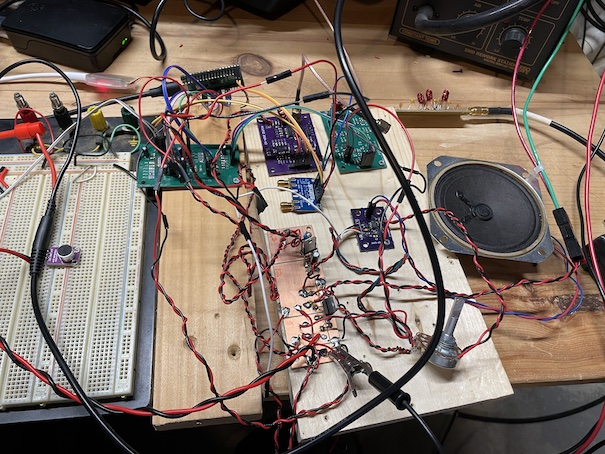

Overview
========

This is a homebrew SDR rig with no dependency on external computers/soundcards/etc. 



Build/Debug Commands
====================

One-time setup of make process:

        git submodule update --init
        mkdir build
        cd build
        cmake -DPICO_BOARD=pico2 ..

Command used to flash code to board:        

        ~/git/openocd/src/openocd -s ~/git/openocd/tcl -f interface/cmsis-dap.cfg -f target/rp2350.cfg -c "adapter speed 5000" -c "rp2350.dap.core1 cortex_m reset_config sysresetreq" -c "program main.elf verify reset exit"

Pico Pinout Notes
=================

GP0  - (Reserved for UART0 TX)
GP1  - (Reserved for UART0 RX)

GP2  - 
GP3  - 
GP4  - SCK out to PCM1804 ADC and PCM5100 DAC
GP5  - RST out to PCM1804 ADC

GP6  - DIN in from PC1804 ADC
GP7  - BCK out to PC1804 ADC
GP8  - LRCK out to PC1804 ADC
GP9  - DOUT out to PCM5100 DAC

GP10 - BCK out to PCM5100 DAC
GP11 - LRCK out to PCM5100 DAC
GP12
GP13
GP14
GP15
GP16 - I2C0 SDA for Si5351 (Addr 0x60)
GP17 - I2C0 SCL for Si5351 (Addr 0x60)

Wiring Notes
============

* RX board I_PLUS (J2:1) -> Audio Breakout INL_PLUS (J4:1)
* RX board I_MINUS (J2:2) -> Audio Breakout INL_MINUS (J4:2)
* RX board Q_PLUS (J2:4) -> Audio Breakout INR_PLUS (J4:4)
* RX board Q_MINUS (J2:5) -> Audio Breakout INR_MINUS (J4:3)

* RX board CLK_I (J4:1) -> Si5351 CLK0
* RX board CLK_Q (J4:3) -> Si5351 CLK1

* Microphone input is connected to the INL_PLUS/INL_MINUS pins on the audio breakout board.

Hardware Notes
==============

### Instrumentation Amplifiers on Receive Board

See Horowitz and Hill (3rd ed, section 5.16, figure 5.88) for a description of the 
instrumentation amplifier congiruation used on the receive board.  Gain for this amplifier is 
controlled determined by 1 + 2 R<sub>f</sub> / R<sub>g</sub>.  Notice that the feedback 
path is tapped after a 47 ohm resistor to set the output impedance of the stage.

Research
========

Consider the PCM1863 ADC? 

References
==========

[PCM1804 Datasheet](https://www.ti.com/lit/ds/symlink/pcm1804.pdf)
[PCM5100 Datasheet](https://www.ti.com/lit/ds/symlink/pcm5102.pdf)

Steps to Build CMSIS-DSP
========================

The library gets built once in a parallel project:

        cd ~/pico
        mkdir CMSISDSP
        cd CMSISDSP
        git clone https://github.com/ARM-software/CMSIS-DSP.git        
        git clone https://github.com/ARM-software/CMSIS_6.git
        cp $PICO_SDK_PATH/external/pico_sdk_import.cmake .

Then setup the CMakeLists.txt shown below and build:

        mkdir build
        cd build
        # IMPORTANT! pico2 build enables the generation of FPU instructions
        cmake -DPICO_BOARD=pico2 ..
        make -j4

What the CMakeLists.txt looks like:

```
cmake_minimum_required (VERSION 3.6)

# Pull in Pico SDK (must be before project)
include(pico_sdk_import.cmake) 

set(HOME $ENV{HOME})
set(CMSISDSP ${HOME}/pico/CMSISDSP/CMSIS-DSP)
set(CMSISCORE ${HOME}/pico/CMSISDSP/CMSIS_6/CMSIS/Core)

# Define the project
project (cmsis-dsp VERSION 0.1)

# Initialise the Pico SDK
pico_sdk_init()

add_subdirectory(${CMSISDSP}/Source bin_dsp)

target_compile_options(CMSISDSP PUBLIC 
    -Wsign-compare
    -Wdouble-promotion
    -Ofast -ffast-math
    -DNDEBUG
    -Wall -Wextra  -Werror
    -fshort-enums 
    #-fshort-wchar
)
```

Example of referencing the built CMSIS-DSP library in a client project:

```
set(HOME $ENV{HOME})
target_include_directories(main PRIVATE
  ${HOME}/pico/CMSISDSP/CMSIS-DSP/Include
  ${HOME}/pico/CMSISDSP/CMSIS_6/CMSIS/Core/Include
)
target_link_libraries(main
  pico_stdlib
  ${HOME}/pico/CMSISDSP/build/bin_dsp/libCMSISDSP.a
)
```
License
=======

SDR2 Rig
Copyright (C) Bruce MacKinnon KC1FSZ, 2025

This program is free software: you can redistribute it and/or modify
it under the terms of the GNU General Public License as published by
the Free Software Foundation, either version 3 of the License, or
(at your option) any later version.

This program is distributed in the hope that it will be useful,
but WITHOUT ANY WARRANTY; without even the implied warranty of
MERCHANTABILITY or FITNESS FOR A PARTICULAR PURPOSE.  See the
GNU General Public License for more details.

You should have received a copy of the GNU General Public License
along with this program.  If not, see <https://www.gnu.org/licenses/>.

FOR AMATEUR RADIO USE ONLY.
NOT FOR COMMERCIAL USE WITHOUT PERMISSION.